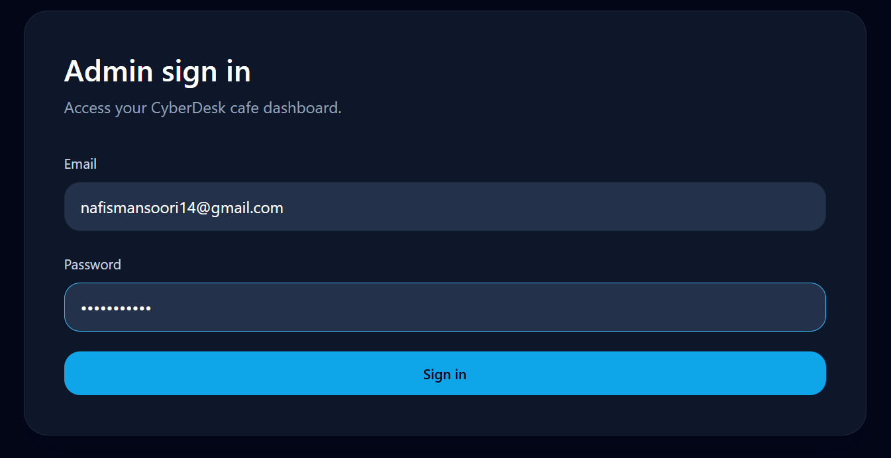
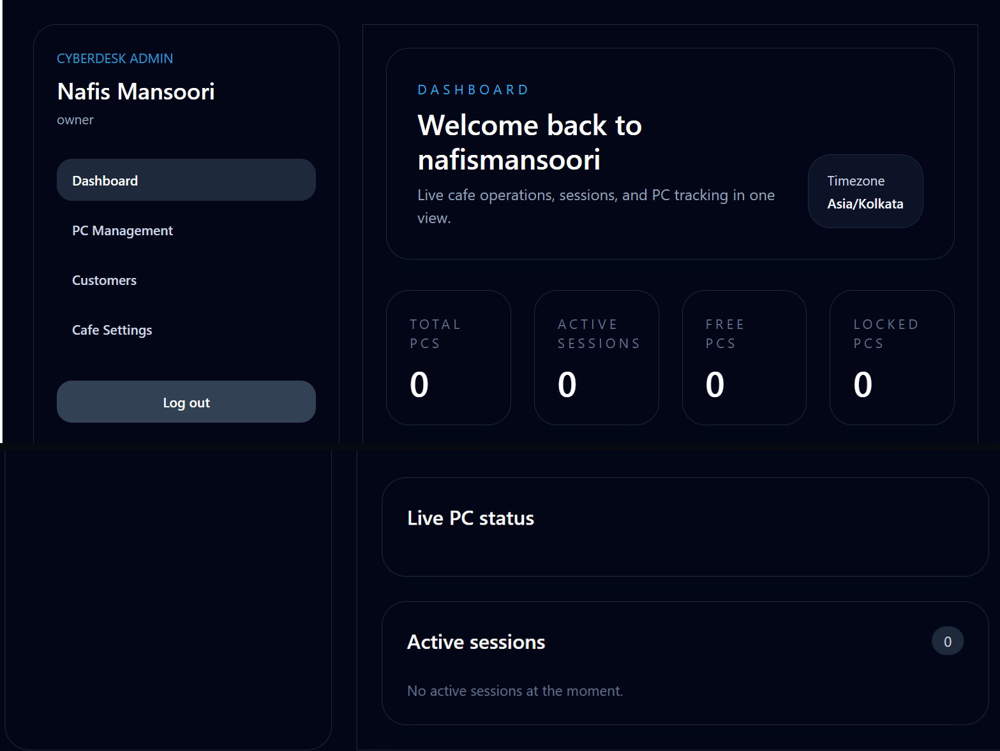
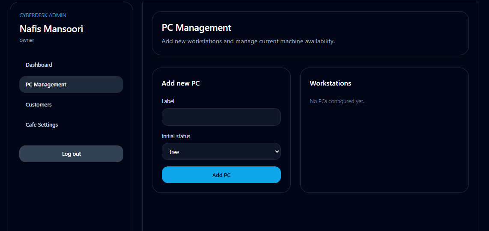
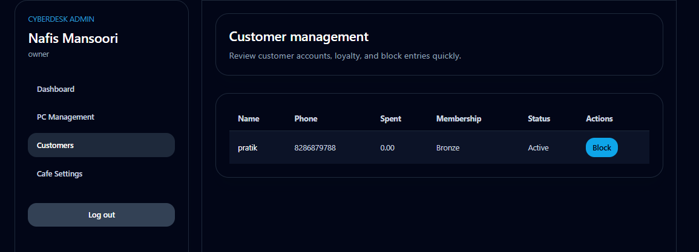
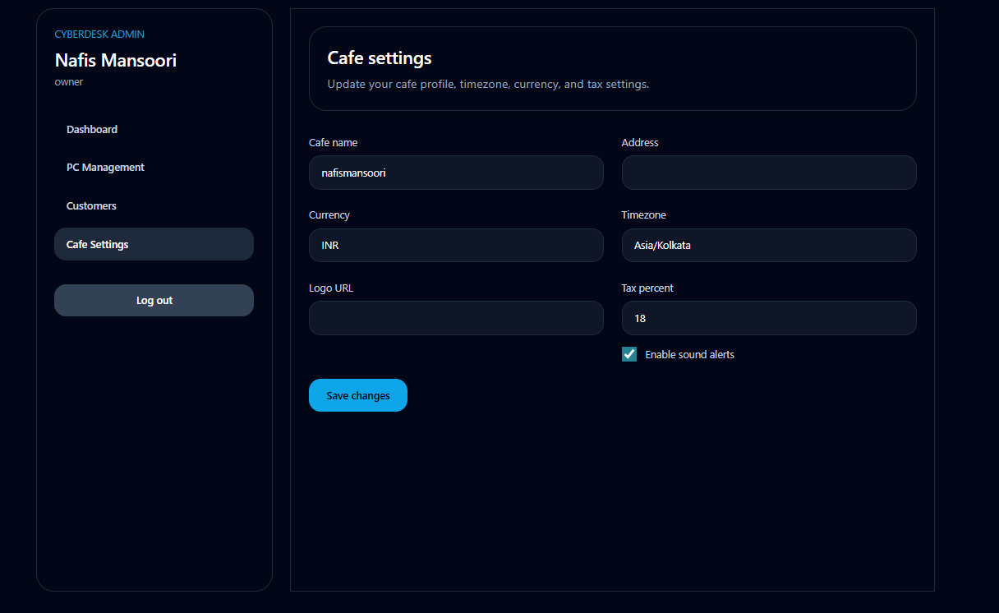
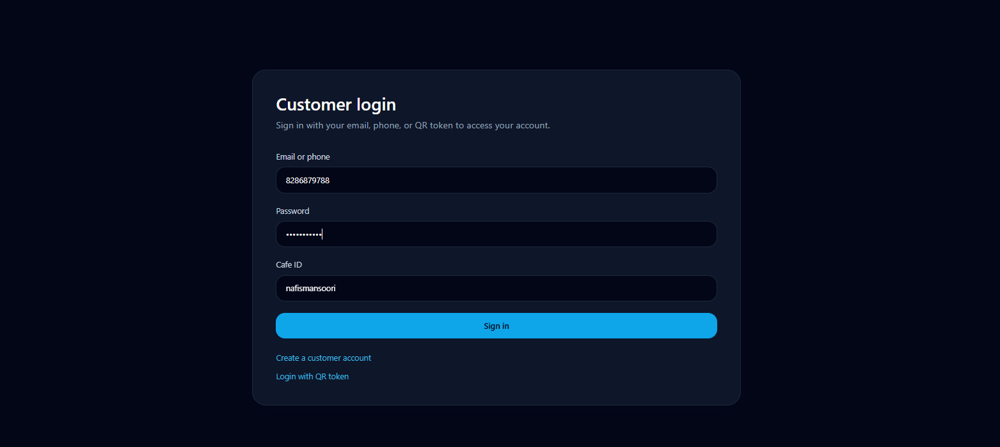
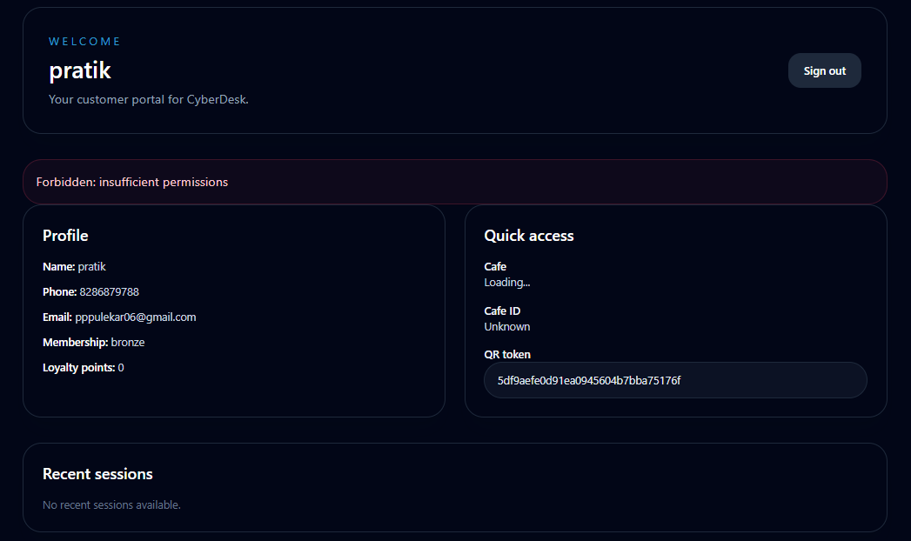
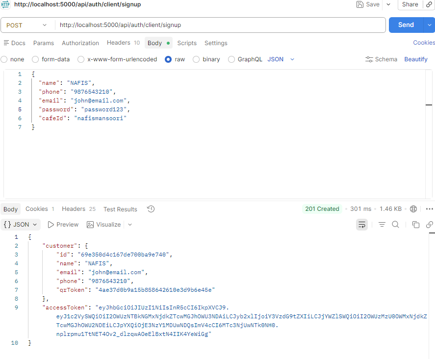
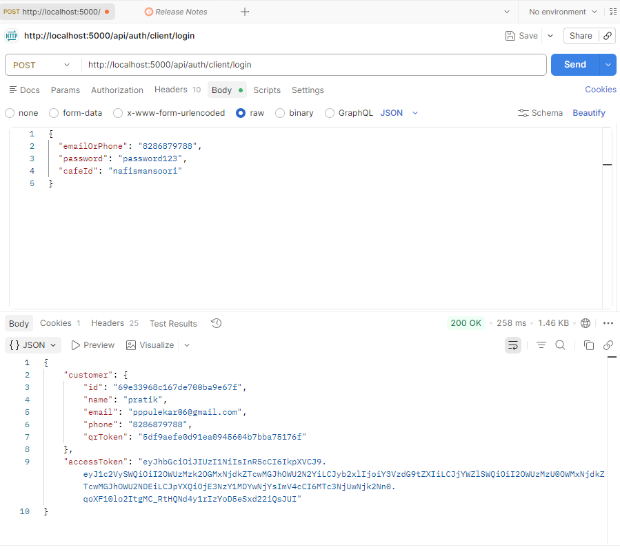

# CyberDesk

**CyberDesk** is a multi-tenant cyber cafe management platform built as a MERN monorepo (MongoDB, Express, React, Node.js) with Socket.io for real-time updates. It gives cafe owners a live admin dashboard to manage PCs, customers, and billing, while customers get a self-service portal to start sessions, top up their wallet, and log in with a QR code.

**Live demo:** [cyberdesk-ten.vercel.app](https://cyberdesk-ten.vercel.app)

> Originally built as a Web Development practical project, the codebase is structured like a real production SaaS scaffold: workspaces, role-based auth, Socket.io live state, and a normalized MongoDB schema.

---

## How It Works

This section walks through every screen of the app, what it's used for, and what happens behind the scenes — the same way the system actually runs.

### 1. Admin Sign In
This is the entry point for the cafe owner/staff. We use this to securely log in to the admin side of CyberDesk with an email and password. On submit, the backend verifies the credentials, checks the bcrypt-hashed password, and issues a JWT access token + refresh token so the session stays authenticated across the dashboard.



---

### 2. Admin Dashboard
Once signed in, the owner lands here. We use this screen to get an at-a-glance view of the whole cafe — total PCs, active sessions, free PCs, and locked PCs — updated live via Socket.io with no page refresh. The sidebar is the main navigation for every other admin feature: PC Management, Customers, and Cafe Settings.



---

### 3. PC Management
We use this page to register every workstation in the cafe. The admin types a label for the PC (e.g. "PC-01"), picks an initial status (`free`, `locked`, etc.), and adds it to the workstation grid. Each PC's status updates instantly across all connected admin screens whenever a session starts or stops on it.



---

### 4. Customer Management
This is where the admin oversees every registered customer. We use it to check a customer's phone number, total spend, membership tier, and account status at a glance, and to **block** a customer (e.g. for abuse or unpaid dues) or unblock them — both reflected immediately in their ability to log in or start sessions.



---

### 5. Cafe Settings
We use this screen to configure how the cafe itself behaves — its display name, address, currency (e.g. INR), timezone, logo, and tax percentage applied to every invoice. There's also a toggle for sound alerts, which plays a notification sound on the admin dashboard for events like a session ending.



---

### 6. Customer Login
This is the customer-facing counterpart to the admin sign-in. We use this so a walk-in customer can log in with their **email, phone number, or a QR token** scanned at the cafe counter — the QR option exists specifically to make repeat visits fast, without typing a password every time.



---

### 7. Customer Dashboard
After logging in, the customer sees their own portal: profile details, membership tier, loyalty points, their personal QR token (for instant login next time), and recent session history. We use this as the customer's self-service hub — wallet top-ups, starting a new session, and tracking past usage all happen from here.



---

### 8. API — Customer Signup
Behind every screen above is a REST API. This is a real request/response captured from the backend: a `POST /api/auth/client/signup` call with the customer's name, phone, email, password, and cafe ID. We use this endpoint to create the customer record and immediately return a generated QR token and a signed JWT access token in the response.



---

### 9. API — Customer Login
The matching login call: `POST /api/auth/client/login`, authenticating with `emailOrPhone`, `password`, and `cafeId`. We use this to verify the customer's credentials server-side and issue a fresh access token, which the client portal then attaches to every subsequent request.



---

## Features

### Admin / Owner Dashboard
- Email + password sign-in with JWT access/refresh tokens
- Live stats: total PCs, active sessions, free PCs, locked PCs
- **PC management** — add workstations, track status (`free`, `active`, `locked`, `maintenance`, `offline`)
- **Customer management** — view profiles, wallet balance, spend, membership tier, block/unblock
- **Session monitoring** — see every active session's PC, customer, start time, running cost
- **Cafe settings** — name, address, currency, timezone, logo, tax percent, sound alerts
- Role-based access control: `owner` / `admin` / `staff`

### Customer Portal
- Sign up / log in with email or phone
- **QR code login** for fast in-cafe access
- Dashboard with wallet balance, profile, and recent session history
- Self-service session start (admin-assisted stop also supported)

### Real-time Engine
- Socket.io broadcasts live cafe snapshots (active/paused/stopped sessions, PC status) to every connected admin client every few seconds
- Per-cafe Socket.io rooms keep tenants isolated
- JWT-authenticated socket handshake

### Security
- bcrypt password hashing
- JWT access + httpOnly refresh token cookies
- Helmet, CORS, rate limiting, and MongoDB query sanitization on the API
- Joi request validation on auth and session endpoints

---

## Tech Stack

| Layer | Technology |
|---|---|
| Frontend (Admin) | React 18, React Router, Zustand, Tailwind CSS, Recharts, Framer Motion, Axios |
| Frontend (Client) | React 18, React Router, Tailwind CSS, Axios |
| Backend | Node.js, Express, Socket.io |
| Database | MongoDB (Mongoose) |
| Auth | JWT (`jsonwebtoken`), bcrypt |
| Validation / Security | Joi, Helmet, express-rate-limit, express-mongo-sanitize |
| Tooling | pnpm workspaces, Vite, ESLint, Jest (scaffolded), Docker Compose |

---

## Project Structure

```
cyberdesk/
├── apps/
│   ├── backend/            # Express + Socket.io API
│   │   └── src/
│   │       ├── config/      # DB connection
│   │       ├── controllers/ # Route handlers (auth, pc, session, customer, cafe...)
│   │       ├── middleware/  # JWT auth, role guard, error handler
│   │       ├── models/      # Mongoose schemas
│   │       ├── routes/      # Express routers
│   │       ├── sockets/     # Socket.io connection + broadcast logic
│   │       └── server.js
│   ├── admin-web/          # React admin dashboard (Vite)
│   └── client-web/         # React customer portal (Vite)
├── docs/
│   └── screenshots/        # README screenshots
├── docker-compose.yml       # Mongo + Redis + all three apps
├── pnpm-workspace.yaml
└── package.json
```

---

## Data Models

| Model | Purpose |
|---|---|
| `Cafe` | Tenant record — name, address, currency, timezone, plan, settings |
| `User` | Staff accounts (`owner` / `admin` / `staff`), scoped to one cafe |
| `Customer` | End users — wallet, membership tier, loyalty points, QR token, block status |
| `PC` | Workstation — status, specs, current session reference |
| `Session` | A billed PC session — start/end time, rate, pauses, status, payment method |
| `Invoice` | Generated bill — line items, subtotal, tax, total |
| `PricingRule` *(scaffolded)* | Time/day-based rate rules (gaming, night, happy hour) |
| `License` *(scaffolded)* | Per-cafe plan/seat licensing |
| `AuditLog` | Tracks admin actions for accountability |

> `PricingRule` and `License` have schemas in place for future use but aren't yet wired into the controllers — current session billing uses a fixed in-memory rate table per `pricingType`.

---

## API Overview

All routes are mounted under `/api`. Protected routes require `Authorization: Bearer <accessToken>`.

| Method & Path | Description | Roles |
|---|---|---|
| `POST /auth/admin/register` | Register a new cafe + owner account | public |
| `POST /auth/admin/login` | Admin/staff login | public |
| `POST /auth/refresh` | Refresh access token | public |
| `POST /auth/logout` | Clear refresh cookie | public |
| `GET /auth/me` | Current admin profile | authenticated |
| `POST /auth/client/signup` | Customer registration | public |
| `POST /auth/client/login` | Customer login (email/phone + cafeId) | public |
| `POST /auth/client/qr-login` | Customer QR token login | public |
| `GET /auth/client/me` | Customer profile | customer |
| `GET /auth/client/me/sessions` | Customer session history | customer |
| `GET /admin/dashboard` | Dashboard stats (PCs, sessions, customers) | owner/admin/staff |
| `GET /pcs` · `POST /pcs` | List / add PCs | owner/admin (write), +staff (read) |
| `PUT /pcs/:id` · `POST /pcs/:id/status` | Update PC / change status | owner/admin/staff |
| `GET /sessions` · `GET /sessions/active` | List sessions / active sessions | owner/admin/staff |
| `POST /sessions/start` | Start a session on a free PC | owner/admin/staff |
| `POST /sessions/:id/pause` · `/resume` · `/stop` | Control a running session | owner/admin/staff |
| `GET /customers` · `GET /customers/:id` | List / view customers | owner/admin/staff |
| `POST /customers/:id/block` · `/unblock` | Block or unblock a customer | owner/admin |
| `GET /cafe` · `PUT /cafe` | View / update cafe settings | owner/admin/staff (read), owner/admin (write) |
| `GET /health` | Service health check | public |

### Socket.io Events
| Event | Direction | Purpose |
|---|---|---|
| `socket:connected` | server → client | Acks auth, returns assigned room |
| `cafe:status` | server → client | Periodic snapshot of session/PC counts for the cafe |
| `session:refresh` | client → server | Request an immediate status broadcast |
| `session:log` | client → server | Write a custom audit log entry |

---

## Getting Started

### Prerequisites
- Node.js 18+
- [pnpm](https://pnpm.io/) (`npm i -g pnpm`)
- MongoDB instance (local or Atlas)

### 1. Install dependencies
```bash
pnpm install
```

### 2. Configure environment variables
Create `apps/backend/.env` (use `.env.example` as a starting point):

```env
PORT=5000
MONGODB_URI=your_mongodb_connection_string
JWT_SECRET=replace_this_with_a_strong_secret
JWT_REFRESH_SECRET=replace_this_with_a_strong_refresh_secret
NODE_ENV=development
```

> ⚠️ **Don't commit real credentials.** Keep `MONGODB_URI` and both JWT secrets out of version control — use placeholder values in any `.env.example` you push, and put the real file only in `.gitignore`d `.env`.

### 3. Run in development
```bash
pnpm --recursive dev
```
This starts:
- Backend API → `http://localhost:5000`
- Admin dashboard → `http://localhost:5173`
- Client portal → `http://localhost:5174`

### 4. Or run with Docker Compose
```bash
docker compose up --build
```
Spins up MongoDB, Redis, and all three apps together.

---

## Roadmap
- [ ] Wire `PricingRule` into session billing for time/day-based rates
- [ ] Activate `License` model for plan/seat enforcement
- [ ] Invoice PDF generation
- [ ] Test suites (Jest is configured; no tests written yet)
- [ ] Analytics/reporting views on the admin dashboard

---

## Author
**Nafis Mansoori**
SY BVoC, Thakur College of Engineering & Technology

## License
This project is licensed under the [MIT License](LICENSE).
